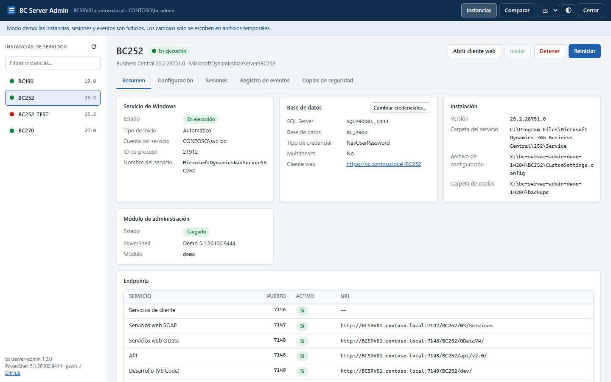
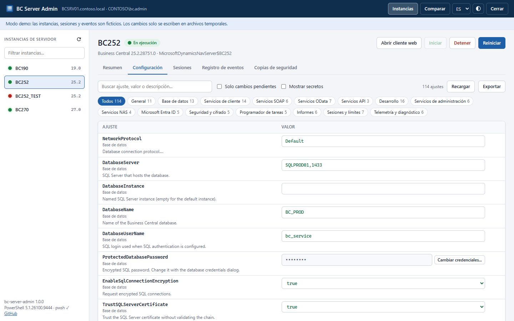
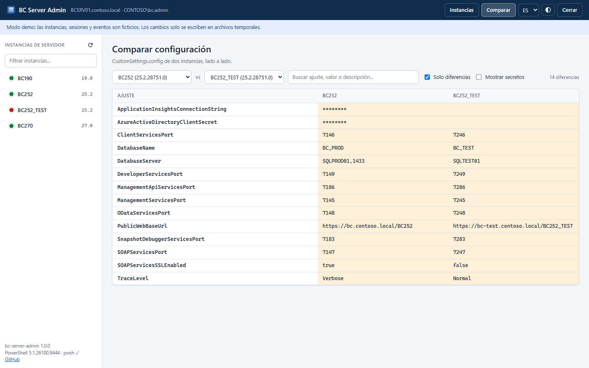
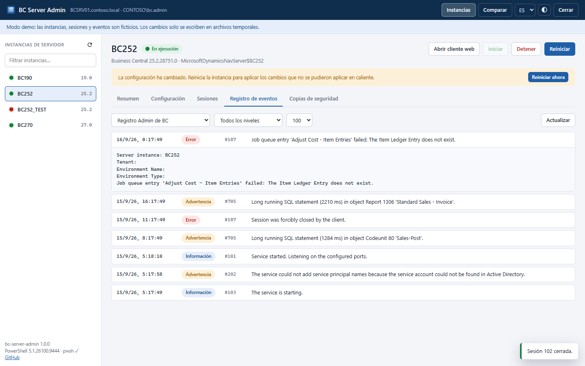

# BC Server Admin

[](https://github.com/galarux/bc-server-admin/actions/workflows/ci.yml)
[](LICENSE)


**Sustituto web de la herramienta de administración del servidor de Business Central (la consola MMC) para Microsoft Dynamics 365 Business Central on-premises.**

Las versiones recientes de Business Central ya no incluyen el complemento MMC. Administrar una instancia obliga a usar cmdlets de PowerShell o a editar `CustomSettings.config` a mano. BC Server Admin recupera esa consola como una página web local: un único script de PowerShell, sin instalador ni dependencias, que funciona con todas las instancias de Business Central / NAV instaladas en el equipo.

[Read in English](README.md)



## Funcionalidades

- **Todas las instancias en una pantalla**: detecta automáticamente todos los servicios `MicrosoftDynamicsNavServer$*`, también con versiones en paralelo (por ejemplo BC 19 y BC 25 en el mismo servidor).
- **Iniciar, detener y reiniciar** instancias, con el estado en vivo y sin bloquear la interfaz.
- **Editor de configuración** agrupado como las pestañas de la antigua MMC (General, Base de datos, Servicios de cliente, SOAP, OData, Desarrollo, NAS, Microsoft Entra ID...):
  - Buscador.
  - La descripción de cada ajuste sale del propio `CustomSettings.config`.
  - Sugerencias de valores conocidos.
  - Contraseñas y secretos ocultos.
  - Revisión de los cambios antes de guardar.
  - Escritura con `Set-NAVServerConfiguration` y, si quieres, aplicación en caliente de los ajustes dinámicos (`-ApplyTo Memory`).
- **Credenciales SQL** con su propio diálogo (`-DatabaseCredentials`), para que la contraseña cifrada se gestione correctamente.
- **Copias de seguridad automáticas** de `CustomSettings.config` antes de cada cambio, con restauración en un clic.
- **Sesiones**: listarlas y cerrarlas.
- **Tenants** en instancias multitenant.
- **Registro de eventos**: el registro Admin de BC y el de aplicación de Windows de la instancia, filtrados por nivel.
- **Comparar** la configuración de dos instancias lado a lado.
- **Exportar** a HTML, CSV o JSON desde la interfaz o por línea de comandos. Los secretos se ocultan salvo que se pidan.
- **Resumen** con puertos, endpoints (URLs de SOAP, OData, API y desarrollo), base de datos, cuenta de servicio y versión.
- Interfaz en español e inglés, con tema claro y oscuro.

| Editor de configuración | Comparar instancias |
| --- | --- |
|  |  |



## Requisitos

- Windows con una o más instancias de servidor de Business Central (o Dynamics NAV).
- Windows PowerShell 5.1, que viene con Windows.
- [PowerShell 7.4+](https://learn.microsoft.com/es-es/powershell/scripting/install/installing-powershell-on-windows), **recomendado para BC 24 a BC 28**. Si está instalado, la herramienta lo usa automáticamente con esas versiones; si no, recurre al módulo de compatibilidad de Windows PowerShell.
- Permisos de administrador. El script pide la elevación por sí mismo.
- Cualquier navegador moderno.

## Inicio rápido

1. Descarga la [última versión](https://github.com/galarux/bc-server-admin/releases) (o **Code > Download ZIP**) y descomprímela en el servidor de BC, por ejemplo en `C:\Tools\bc-server-admin`.
2. Desbloquea los archivos descargados (solo la primera vez):

   ```powershell
   Get-ChildItem C:\Tools\bc-server-admin -Recurse | Unblock-File
   ```

3. Haz doble clic en **`Start-BCServerAdmin.cmd`** y acepta el aviso de UAC.

El navegador se abre en `http://localhost:<puerto>/?t=<token>`. Deja abierta la ventana de consola mientras trabajas. Para parar la herramienta, ciérrala o pulsa **Cerrar** en la interfaz; tus instancias de BC siguen funcionando.

¿Quieres verla antes de usarla? El modo demo no necesita ni Business Central ni permisos de administrador:

```powershell
.\Start-BCServerAdmin.cmd -Demo
```

## Línea de comandos

```powershell
.\Start-BCServerAdmin.ps1 [-Port <int>] [-NoBrowser] [-Demo] [-WorkerHost Auto|WindowsPowerShell|PowerShell7] [-BackupPath <carpeta>]
```

| Parámetro | Descripción |
| --- | --- |
| `-Port` | Puerto del servidor web local. Por defecto, uno libre al azar. |
| `-NoBrowser` | No abre el navegador; solo muestra la URL. |
| `-Demo` | Usa instancias ficticias, sin BC y sin permisos de administrador. |
| `-WorkerHost` | PowerShell con el que se carga el módulo de administración de BC. `Auto` usa PowerShell 7 para BC 24-28 si está disponible y Windows PowerShell en el resto de casos. |
| `-BackupPath` | Carpeta de las copias de seguridad. Por defecto, `%ProgramData%\BCServerAdmin\backups\<instancia>`. |

### Exportar sin abrir la interfaz

Sustituye al clásico script que vuelca la configuración a un HTML y no requiere elevación:

```powershell
# Un informe HTML por instancia
.\Start-BCServerAdmin.ps1 -ExportPath C:\Temp\bc-config

# Instancias concretas, en CSV, incluyendo contraseñas
.\Start-BCServerAdmin.ps1 -ExportPath C:\Temp\bc-config -Instance BC252,BC260 -Format Csv -IncludeSecrets
```

El informe HTML es un archivo autónomo con buscador y una sección por categoría.

## Cómo funciona

```text
Navegador (solo localhost) ──HTTP + token──> Start-BCServerAdmin.ps1 (elevado)
                                               ├─ servicios, visor de eventos, CustomSettings.config (directo)
                                               └─ un proceso worker por carpeta Service de BC
                                                    └─ módulo de administración de BC → Set-NAVServerConfiguration,
                                                       Get/Remove-NAVServerSession, Get-NAVTenant
```

- **Detección**:
  - Las instancias salen de los servicios de Windows `MicrosoftDynamicsNavServer$<instancia>`.
  - La versión se lee del ejecutable `Microsoft.Dynamics.Nav.Server.exe`. El nombre de la carpeta no sirve: BC 25.3 también se instala en `252`.
  - `CustomSettings.config` se localiza con el argumento `/config` del servicio y, si no, en `Instances\<nombre>\` o en la carpeta Service.
- **Lectura**: el XML se analiza directamente. Es rápido, vale para cualquier versión y conserva los comentarios como ayuda.
- **Escritura**: se hace con `Set-NAVServerConfiguration` en un proceso worker distinto por cada carpeta Service, porque las distintas versiones de BC no pueden cargar sus ensamblados en el mismo proceso. El worker importa el primer módulo que funcione:
  1. `Admin\Microsoft.BusinessCentral.Management.psd1` (con PowerShell 7, o con cualquiera a partir de BC 29).
  2. `Microsoft.Dynamics.Nav.Management.psm1`.
  3. `Management\Microsoft.Dynamics.Nav.Management.dll` (módulo de compatibilidad de BC 24-28).
  4. `Microsoft.Dynamics.Nav.Management.dll`.
- **Si no se puede cargar el módulo**, la interfaz ofrece escribir los valores directamente en `CustomSettings.config`, siempre con copia de seguridad previa.
- **Control del servicio**: usa la API de servicios de Windows y nunca espera dentro de una petición, así que la página se sigue actualizando mientras la instancia arranca o se detiene.

## Seguridad

La herramienta se ejecuta elevada y puede reconfigurar tus servidores, así que el servidor web está bien cerrado:

- Solo escucha en `http://localhost` y rechaza clientes que no sean locales o cabeceras `Host` inesperadas.
- Cada llamada a la API necesita un token aleatorio que cambia en cada ejecución. Se pasa una vez en la URL, se borra de la barra de direcciones y después viaja como cabecera.
- Los cambios exigen `POST` con `application/json` desde el mismo origen, lo que bloquea peticiones cruzadas desde otras páginas.
- Aplica una Content Security Policy estricta: sin scripts en línea, sin CORS, sin caché y sin peticiones externas.
- Las contraseñas y los secretos se ocultan en la interfaz y, por defecto, en las exportaciones.
- El navegador se abre sin elevación.

No se envía nada a ningún sitio: ni telemetría ni comprobación de actualizaciones.

## Solución de problemas

| Problema | Qué hacer |
| --- | --- |
| "la ejecución de scripts está deshabilitada en este sistema" | Usa `Start-BCServerAdmin.cmd` (pasa `-ExecutionPolicy Bypass`) y ejecuta `Unblock-File` sobre los archivos descomprimidos. Si la política la impone una directiva de grupo, habla con tu administrador. |
| La tarjeta **Módulo de administración** muestra *No se pudo cargar* | Lee el error de la tarjeta. En BC 24-28, instala PowerShell 7.4+ o arranca con `-WorkerHost PowerShell7`. Mientras tanto, puedes guardar directamente en el archivo. |
| "Access is denied... local Administrators group" | La herramienta no está elevada. Arráncala con el `.cmd` o desde una consola de administrador. |
| No se abre el navegador | Copia la URL que aparece en la consola. Usa `-Port` si el puerto está bloqueado. |
| "El token de sesión no es válido" | La herramienta se reinició. Abre la nueva URL de la consola. |

## Desarrollo

```text
Start-BCServerAdmin.ps1   punto de entrada (parámetros, elevación, modo exportación)
Start-BCServerAdmin.cmd   lanzador para doble clic
src/                      PowerShell: detección, configuración, servicios/eventos, worker, servidor HTTP, demo
web/                      interfaz estática (JS sin frameworks ni compilación) y metadatos de ajustes
tests/                    pruebas Pester 5 (unitarias + HTTP en modo demo)
```

- Interfaz con datos ficticios: `.\Start-BCServerAdmin.ps1 -Demo -NoBrowser`. Los archivos web se sirven desde disco, así que basta con recargar el navegador para ver los cambios.
- Pruebas (Pester 5 o superior): `Invoke-Pester ./tests`.
- Análisis estático: `Invoke-ScriptAnalyzer -Path . -Recurse -Settings ./PSScriptAnalyzerSettings.psd1`.
- Mantén los `.ps1` en **ASCII puro**, porque Windows PowerShell 5.1 lee como ANSI los archivos sin BOM. Los textos traducidos están en `web/js/i18n.js`.
- Para categorizar un ajuste nuevo o añadir sugerencias de valores, edita `web/data/settings-meta.json`.

Se agradecen incidencias y pull requests. Si informas de un error, indica tu versión de BC y lo que muestra la tarjeta **Módulo de administración**.

## Compatibilidad

Desarrollado contra Business Central 19 y el modo demo integrado; las pruebas se ejecutan en Windows PowerShell 5.1 y PowerShell 7. El cargador de módulos sigue las estructuras que usa Microsoft desde NAV 2018 / BC 14 hasta BC 29, pero las versiones distintas de BC 19 aún no se han verificado en un servidor real. Si algo no funciona con la tuya, [abre una incidencia](https://github.com/galarux/bc-server-admin/issues).

## Licencia

[MIT](LICENSE). Este proyecto no está afiliado a Microsoft ni cuenta con su respaldo. Microsoft Dynamics 365 Business Central y Dynamics NAV son marcas de Microsoft Corporation.
