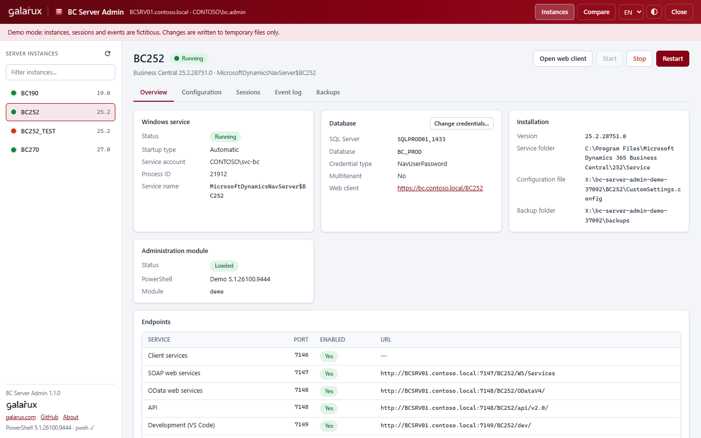
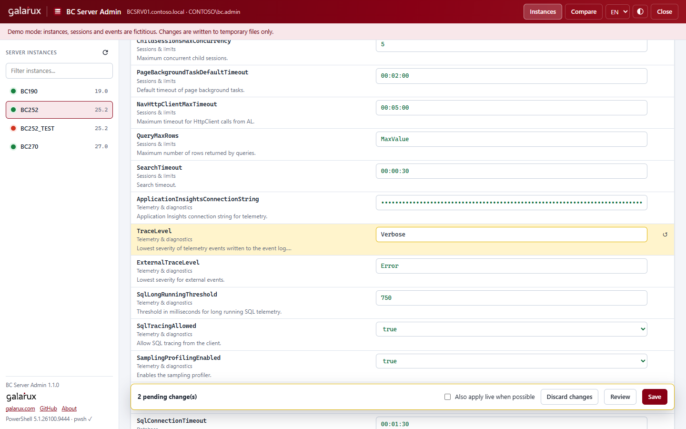
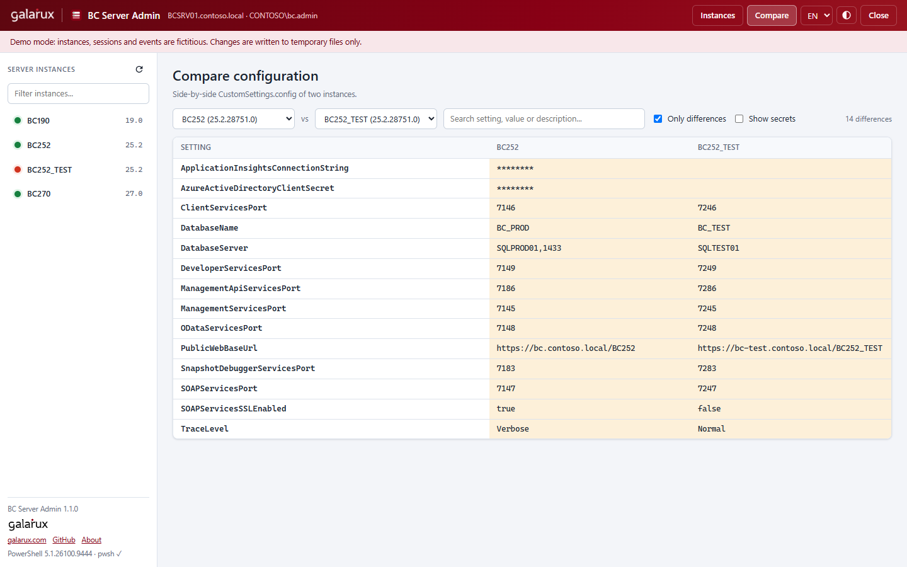
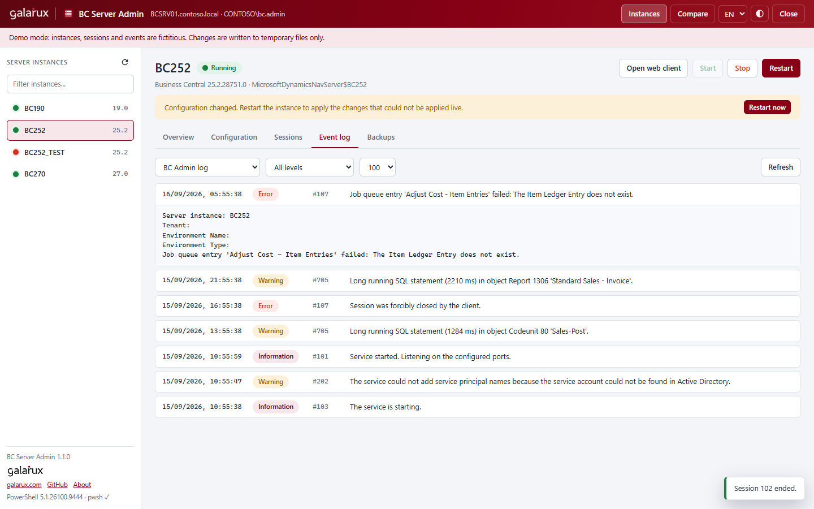
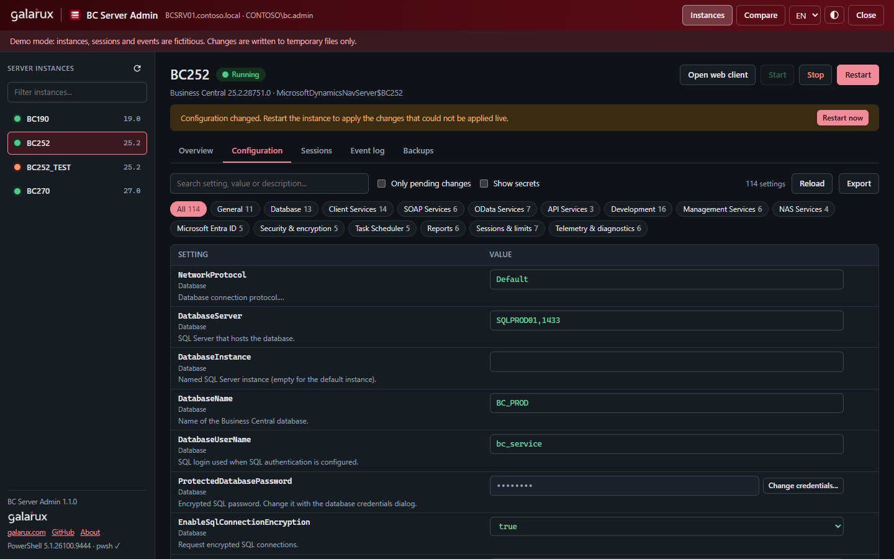

<p align="center">
  <a href="https://galarux.com"></a>
</p>

# BC Server Admin

[](https://github.com/galarux/bc-server-admin/actions/workflows/ci.yml)
[](LICENSE)


**A web-based replacement for the Business Central Server Administration tool (the MMC console) for Microsoft Dynamics 365 Business Central on-premises.**

Recent versions of Business Central no longer ship the old MMC snap-in, so managing a server instance means using PowerShell cmdlets or editing `CustomSettings.config` by hand. BC Server Admin gives you that console back as a local web page. It is a single PowerShell script with no installer and no dependencies, and it works with every Business Central / NAV instance installed on the machine.

A free, open-source tool by **[Galarux](https://galarux.com)**, Microsoft partner specialised in Business Central.

[Leer en español](README.es.md)



## Features

- **All instances on one screen.** Every `MicrosoftDynamicsNavServer$*` service is detected automatically, including side-by-side versions (for example BC 19 and BC 25 on the same server).
- **Start, stop and restart** instances. Status updates live and the UI never blocks.
- **Configuration editor** grouped like the old MMC tabs (General, Database, Client Services, SOAP, OData, Development, NAS, Microsoft Entra ID...).
  - Search box.
  - Each setting shows the description from `CustomSettings.config`.
  - Known values are suggested.
  - Passwords and secrets are masked.
  - You can review your changes before saving.
  - Changes are written with `Set-NAVServerConfiguration`. Optionally, dynamic settings are also applied live (`-ApplyTo Memory`).
- **SQL credentials** dialog (`-DatabaseCredentials`), so the encrypted password is handled properly.
- **Automatic backups** of `CustomSettings.config` before every change, with one-click restore.
- **Sessions**: list and end sessions.
- **Tenants** on multitenant instances.
- **Event log**: the BC Admin log and the Windows Application log for the selected instance, filtered by level.
- **Compare** the configuration of two instances side by side.
- **Export** to HTML, CSV or JSON, from the UI or from the command line. Secrets are redacted unless you ask for them.
- **Overview** of ports, endpoints (SOAP / OData / API / dev URLs), database, service account and version.
- English and Spanish UI, plus light and dark themes.

| Configuration editor | Compare instances |
| --- | --- |
|  |  |
| **Event log** | **Dark theme** |
|  |  |

## Requirements

- Windows with one or more Business Central (or Dynamics NAV) server instances installed.
- Windows PowerShell 5.1, which ships with Windows.
- [PowerShell 7.4+](https://learn.microsoft.com/powershell/scripting/install/installing-powershell-on-windows) is **recommended for BC 24 to BC 28**. The tool uses it automatically for those versions when it is installed. Without it, the tool falls back to the compatibility module that Windows PowerShell loads.
- Administrator rights. The script asks for elevation itself.
- Any modern browser.

## Quick start

1. Download the [latest release](https://github.com/galarux/bc-server-admin/releases) (or **Code > Download ZIP**) and extract it on the BC server, for example to `C:\Tools\bc-server-admin`.
2. Unblock the downloaded files once:

   ```powershell
   Get-ChildItem C:\Tools\bc-server-admin -Recurse | Unblock-File
   ```

3. Double-click **`Start-BCServerAdmin.cmd`** and accept the UAC prompt.

The browser opens at `http://localhost:<port>/?t=<token>`. Keep the console window open while you work. Close it, or click **Close** in the UI, to stop the tool. Your BC instances keep running.

Want to look around first? Demo mode needs neither Business Central nor admin rights:

```powershell
.\Start-BCServerAdmin.cmd -Demo
```

## Command line

```powershell
.\Start-BCServerAdmin.ps1 [-Port <int>] [-NoBrowser] [-Demo] [-WorkerHost Auto|WindowsPowerShell|PowerShell7] [-BackupPath <folder>]
```

| Parameter | Description |
| --- | --- |
| `-Port` | Port for the local web server. The default is a random free port. |
| `-NoBrowser` | Only print the URL, do not open the browser. |
| `-Demo` | Use fictitious instances. No BC and no admin rights needed. |
| `-WorkerHost` | PowerShell used to load the BC management module. `Auto` uses PowerShell 7 for BC 24-28 when available and Windows PowerShell otherwise. |
| `-BackupPath` | Where backups are stored. The default is `%ProgramData%\BCServerAdmin\backups\<instance>`. |

### Export without opening the UI

This replaces the classic "dump the configuration to an HTML file" script, and it does not require elevation:

```powershell
# One HTML report per instance
.\Start-BCServerAdmin.ps1 -ExportPath C:\Temp\bc-config

# Selected instances, as CSV, including passwords
.\Start-BCServerAdmin.ps1 -ExportPath C:\Temp\bc-config -Instance BC252,BC260 -Format Csv -IncludeSecrets
```

The HTML report is a standalone file with a search box and one section per category.

## How it works

```text
Browser (localhost only) ──HTTP + token──> Start-BCServerAdmin.ps1 (elevated)
                                             ├─ services, event log, CustomSettings.config (direct)
                                             └─ one worker process per BC Service folder
                                                  └─ BC management module → Set-NAVServerConfiguration,
                                                     Get/Remove-NAVServerSession, Get-NAVTenant
```

- **Discovery.**
  - Instances come from the Windows services `MicrosoftDynamicsNavServer$<instance>`.
  - The version comes from the file version of `Microsoft.Dynamics.Nav.Server.exe`. The folder name is not reliable: BC 25.3 also installs to `252`.
  - `CustomSettings.config` is found through the `/config` argument of the service, falling back to `Instances\<name>\` or the Service folder.
- **Reading** the configuration parses the XML directly. It is fast, works for any version and keeps the comments as help text.
- **Writing** uses `Set-NAVServerConfiguration` in a separate worker process for each Service folder, because different BC versions cannot load their assemblies into the same process. The worker imports the first module that works:
  1. `Admin\Microsoft.BusinessCentral.Management.psd1`: PowerShell 7, or any host from BC 29.
  2. `Microsoft.Dynamics.Nav.Management.psm1`
  3. `Management\Microsoft.Dynamics.Nav.Management.dll`: the BC 24-28 compatibility module.
  4. `Microsoft.Dynamics.Nav.Management.dll`
- **Fallback when the module cannot be loaded.** The UI offers to write the values straight into `CustomSettings.config`, after taking a backup.
- **Service control** uses the Windows service API and never waits inside a request, so the page keeps updating while an instance starts or stops.

## Security

The tool runs elevated and can reconfigure your servers, so the web server is locked down:

- It listens on `http://localhost` only and rejects non-loopback clients and unexpected `Host` headers.
- Every API call needs a random per-run token. The token is passed once in the URL, removed from the address bar and sent as a header.
- Changes must be `POST` with `application/json` from the same origin, which blocks cross-site requests from other pages.
- A strict Content Security Policy is applied, with no inline scripts, no CORS, no caching and no external requests.
- Passwords and secrets are masked in the UI and redacted in exports by default.
- The browser is opened without elevation.

Nothing is sent anywhere: there is no telemetry and no update check.

## Troubleshooting

| Problem | What to do |
| --- | --- |
| "running scripts is disabled on this system" | Use `Start-BCServerAdmin.cmd` (it passes `-ExecutionPolicy Bypass`) and run `Unblock-File` on the extracted files. If a Group Policy enforces the execution policy, ask your administrator. |
| The **Administration module** card shows *Could not be loaded* | Read the error on that card. On BC 24-28, install PowerShell 7.4+ or start with `-WorkerHost PowerShell7`. You can still save changes directly to the file. |
| "Access is denied... local Administrators group" | The tool is not elevated. Start it with the `.cmd` launcher or from an elevated console. |
| The browser does not open | Copy the URL printed in the console window. Use `-Port` if the port is blocked. |
| "The session token is not valid" | The tool was restarted. Open the new URL from the console. |

## Development

```text
Start-BCServerAdmin.ps1   entry point (parameters, elevation, export mode)
Start-BCServerAdmin.cmd   double-click launcher
src/                      PowerShell: discovery, config, services/events, worker, HTTP server, demo
web/                      static UI (vanilla JS, no build step) and settings metadata
tests/                    Pester 5 tests (unit + demo-mode HTTP tests)
```

- Run the UI with fictitious data: `.\Start-BCServerAdmin.ps1 -Demo -NoBrowser`. Web files are served from disk, so refreshing the browser picks up changes.
- Run the tests (Pester 5 or later): `Invoke-Pester ./tests`
- Lint: `Invoke-ScriptAnalyzer -Path . -Recurse -Settings ./PSScriptAnalyzerSettings.psd1`
- Keep `.ps1` files **pure ASCII**, because Windows PowerShell 5.1 reads BOM-less files as ANSI. Translated text lives in `web/js/i18n.js`.
- To categorise a new setting or add value suggestions, edit `web/data/settings-meta.json`.

Issues and pull requests are welcome. For a bug, include your BC version and the contents of the **Administration module** card.

## Compatibility

Developed against Business Central 19 and the built-in demo mode. Tests run on Windows PowerShell 5.1 and PowerShell 7. The module loader follows the layouts Microsoft uses from NAV 2018 / BC 14 up to BC 29, but versions other than BC 19 have not been verified on a real server yet. If something does not work with yours, please [open an issue](https://github.com/galarux/bc-server-admin/issues).

## About Galarux

<a href="https://galarux.com">
  <picture>
    <source media="(prefers-color-scheme: dark)" srcset="web/img/galarux-logo-white.png">
    
  </picture>
</a>

BC Server Admin is developed and maintained by **Galarux**, an official Microsoft partner specialised in Business Central. We provide support, custom development and vertical solutions such as [Galarux Gantt](https://galarux.com/productos/galaruxgantt/), and we help other partners during workload peaks.

- Website: [galarux.com](https://galarux.com)
- Contact: [info@galarux.com](mailto:info@galarux.com)

Need a hand with your Business Central servers? Get in touch.

## License

[MIT](LICENSE), © 2026 Galarux Software and Consulting S.L.

The Galarux name and logos (`web/img/galarux-*`, `docs/images/banner-*`, `docs/images/**/social-preview.png`) are not covered by the MIT license. Remove them from forks you redistribute under another name.

This project is not affiliated with or endorsed by Microsoft. Microsoft Dynamics 365 Business Central and Dynamics NAV are trademarks of Microsoft Corporation.
